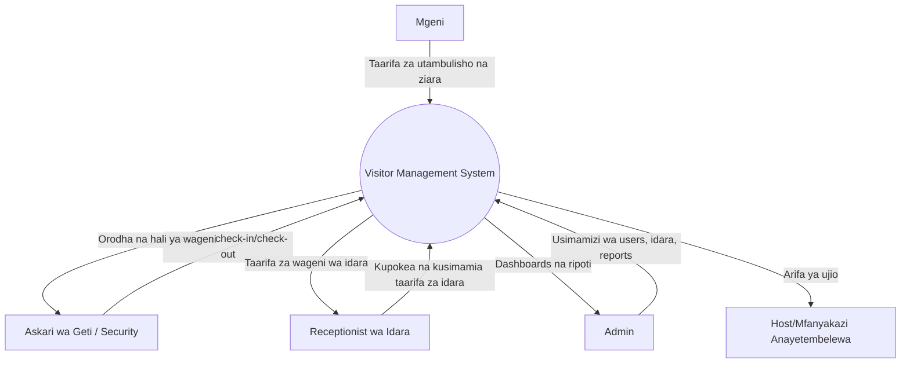

# Data Flow Diagram (DFD) - Visitor Management System

## Context Diagram (Wima)

```mermaid
flowchart TD
    M[Mgeni]
    S[Askari wa Geti / Security]
    R[Receptionist wa Idara]
    A[Admin]
    H[Host/Mfanyakazi Anayetembelewa]

    SYS((Visitor Management System))

    M -->|Taarifa za utambulisho na ziara| SYS
    S -->|Usajili wa check-in/check-out| SYS
    R -->|Kupokea na kusimamia taarifa za idara| SYS
    A -->|Usimamizi wa users, idara, reports| SYS

    SYS -->|Orodha na hali ya wageni| S
    SYS -->|Taarifa za wageni wa idara| R
    SYS -->|Dashboards na ripoti| A
    SYS -->|Arifa ya ujio| H
```

Figure 1: Context-level DFD ya Visitor Management System.
